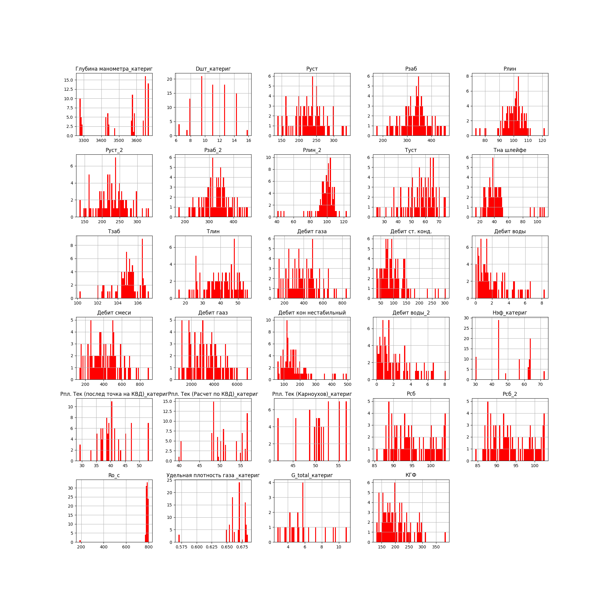
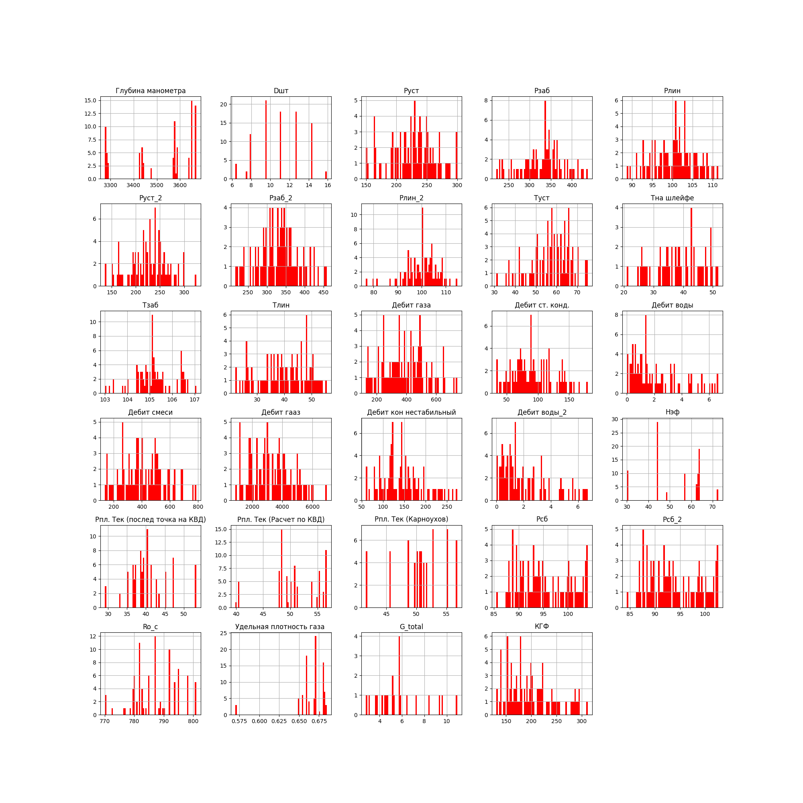
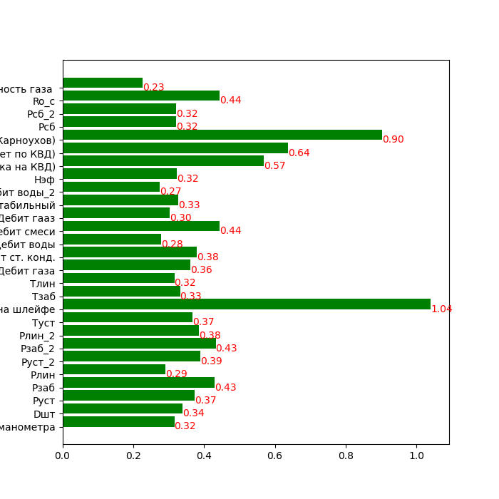
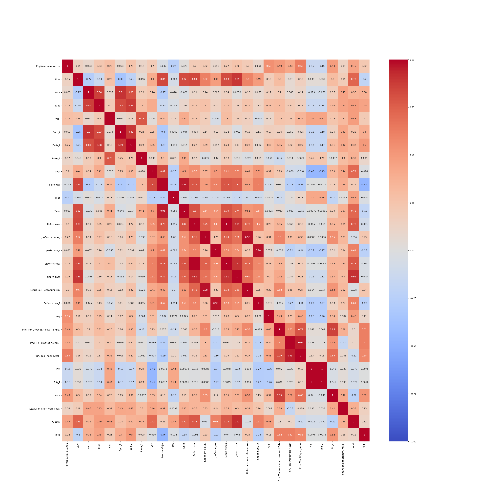

# NeuralNetworksLab1

### Удаляем мусор
1) Нумеруем повторяющиеся столбцы. Например:
Рлин, Рлин_2. Запоминаем в массив headers.
2) Удаляем первые две строки с подписями
столбцов
3) Удаляем первые два ненужных столбца.
4) Названиями колонок ставим массив
названий колонок, которые мы получили выше.
5) Сбрасываем нумерацию строк.
6) Там где нехватает значений в КГФ, а в КГФ_2
есть, добавляем в КГФ = КГФ_2 * 1000.
7) Удаляем столбец КГФ_2.
8) Удаляем нулевые значения из КГФ и G_total
9) Сбрасываем нумерацию.

Результат в content/withoutMess.csv

### Непрерывные Признаки
1) Количество в каждой колонке
2) Процент пропусков в колонке
3) Минимальное значение в колонке
4) Максимальное значение в клонке
5) Среднее значение по колонке
6) Мощность - количество уникальных 
значений в столбце
7) % уникальных - процент уникальных из всех
ненулевых значений колонки
8) Квантиль 0.25 например равен Х - значит 
что 25% значений из колонки <= Х.
9) Медиана набора чисел — число, которое
находится в середине этого набора, если 
его упорядочить по возрастанию.
10) Второй квартиль 0.75.
11) Среднеквадратическое отклонение — в 
теории вероятностей и статистике наиболее 
распространённый показатель рассеивания 
значений случайной величины относительно
её математического ожидания. 

Находим для всех столбцов. Результат в content/parametersTable.csv

### Формируем категориальные признаки
1) Удаляем, где больше 60% пропусков
Ro_g  больше 60% пропусков
Ro_w  больше 60% пропусков
2) Также удаляем, где можность 1, но этот
столбец уже удалился Ro_w.
3) Там где мощность < 25 добавляем в 
массив категориальных признаков,
остальные в массив непрерывных признаков.

Результат в content/without60.csv

### Категориальные признаки
1) Для категориальных признаков, выписываем 
опять Кол-во, %пропусков, мощность.
2) мода1 - это первое самое встречаемое значение
3) частота моды1 - сколько раз встретилось 
первое по встречаемости значение
4) % моды1 - процент такого первого по 
втречаемости значения среди всех
5) мода2 - это второе самое встречаемое значение
6) частота моды2 - сколько раз встретилось 
второе по встречаемости значение
7) % моды2 - процент такого второго по 
втречаемости значения среди всех

### Строим гистограммы по всем признакам

### Избавляемся от выбросов
1) Анализируем графики. Ищем какие похожи на 
нормальное распределение. Видим выбросы.
2) Хотим избавиться от выбросов.
3) Задем порог отсечения выбросов
4) Для нормального распределения - "среднее минус
2 * стандартное отклонение" - нижняя граница,
"среднее плюс 2 * стандартное отклонение" -  
верхняя граница
5) Для другого - верхняя граница - "второй квартиль
плюс 1.5 * (второй квартиль минус первый)", нижняя
граница - "первый квантиль минус 1.5 * (второй 
минус первый)" 
6) Проходимся по всем значениям, если выходит за
границу ставим nan. Если КГФ то удаляем строку.
Если есть nan и пропусков меньше 30%, то записываем
медиану.
7) Обновляем нумерацию.

### Критерий прироста информации(gain ratio)
1) Вычисляя критерий прироста информации для 
разных атрибутов, можно понять разбиение по какому
обспечит наибольший прирост информации.  Этот анализ
является одним из методов, используемых для 
определения того, какие функции больше всего влияют
на целевую переменную.
2) Правило Стерджеса - правило определения
оптимального количества интервалов, на которые 
разбивается наблюдаемый диапазон изменения
случайной величины при построении гистограммы
плотности ее распределения. n = 1 + log_2(N)
3) Строим гистокрамму gain_ratio по формулам из презентации

### Строим тепловую карту корреляций
1) Посчитав gain_ration, строим тепловую корреляци
онную матрицу. 

### Удаляем по тепловой карте
1)Там где в матрице значение 
коррелляции больше 0.9 удаляем тот который имеет
меньшее gain_ratio.

Итого удалили после этого шага 'Руст', 'Руст_2', 'Рзаб_2', 'Дебит газа', 'Дебит гааз', 'Дебит кон нестабильный', 'Дебит воды_2', 'Pсб_2' 'Рпл. Тек (послед точка на КВД)','Рпл. Тек (Расчет по КВД)'
